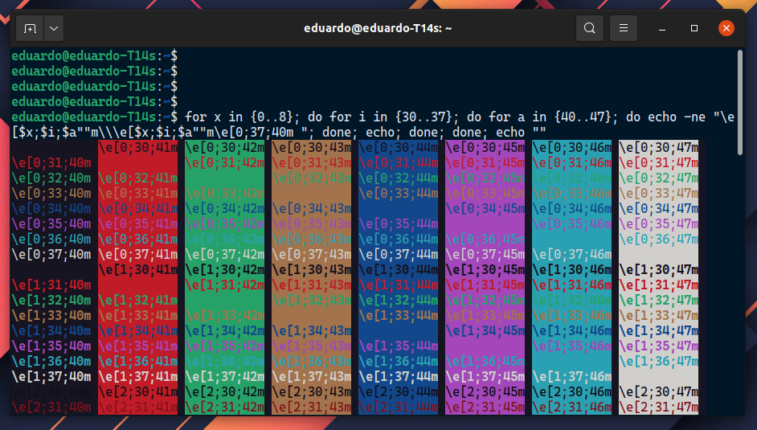
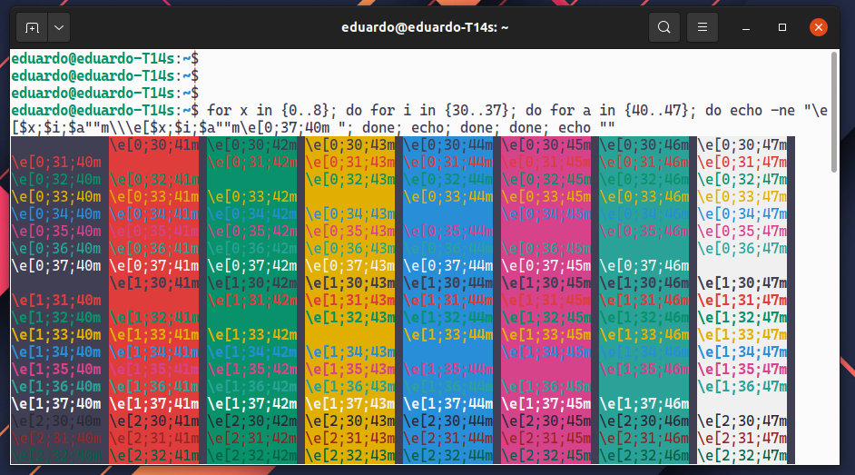

#  sdras Night Owl theme for GNOME Terminal


---


Here are Night Owl and Light Owl themes for GNOME Terminal (available on Ubuntu, Fedora, Elementary OS, etc). These themes use this adaptation of [color palette](COLORS) from original [Night Owl](https://github.com/sdras/night-owl-vscode-theme/blob/main/themes/Night%20Owl-color-theme.json) and [Light Owl](https://github.com/sdras/night-owl-vscode-theme/blob/main/themes/Night%20Owl-Light-color-theme.json) syntax theme.

## Installation

For installation just execute desired command below. **Be careful, terminal may closed after install.**

This scripts creates a new profile for each version of the theme, I advice make a backup of your current profile to avoid losing it.

**Night Owl**

```
bash -c "$(curl -fsSL https://raw.githubusercontent.com/edurojasr/night-owl--gnome-terminal/master/night-owl.sh)"
```

**Light Owl**

```
bash -c "$(curl -fsSL https://raw.githubusercontent.com/edurojasr/night-owl--gnome-terminal/master/light-owl.sh)"
```

## Fonts

Really great font that I like [Cascadia Code](https://github.com/microsoft/cascadia-code)

## Credits

* Scripts base on: [denysdovhan](https://github.com/denysdovhan/one-gnome-terminal)
* Theme colors base on: [sdras](https://github.com/sdras/night-owl-vscode-theme)

Thanks you! :)

## License

[MIT](LICENSE.mb)